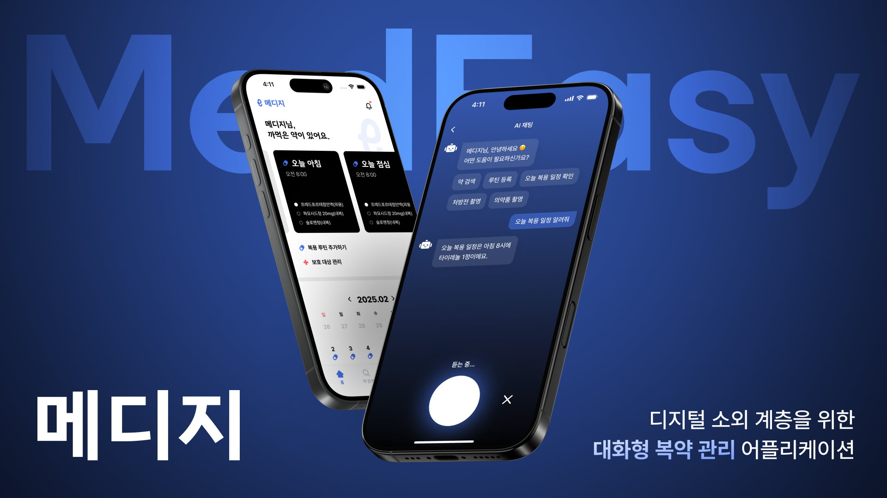
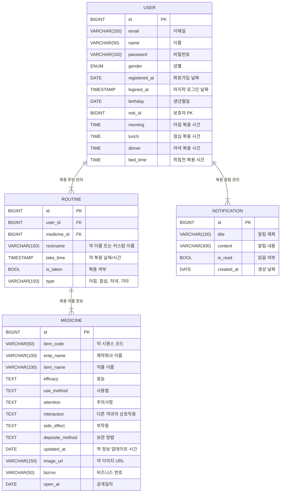

# 💊 MedEasy

**MedEasy**는 노년층, 장애인 및 만성 질환 환자를 위한 **간편하고 안전한 복약 관리 앱**입니다.  
처방전에서 약 정보를 자동으로 등록하고, NFC 태그를 통해 복용 여부를 쉽게 체크할 수 있습니다. 또한 AI 기반 챗봇을 통해 약 정보를 빠르고 정확하게 제공하며, 알림 기능으로 규칙적인 복약을 도와줍니다.

---

## 📱 프로젝트 개요
| 항목 | 내용 |
|-------|-------|
| **목적** | 간편하고 안전한 복약 관리 시스템 구축 |
| **주요 대상** | 노년층, 장애인, 만성 질환 환자 |
| **개발 플랫폼** | 모바일 앱 (Android, iOS) |
| **개발 기간** | 2025년 2월 ~ 2025년 5월 |

---

## 🚀 주요 기능
- 📸 **처방전 촬영** → OCR을 통한 약 정보 자동 등록  
- 🔎 **공공 API 기반 검색** → 정확한 약 정보 제공  
- 📆 **복약 일정 관리** → 사용자 루틴 기반 일정 관리  
- 🛜 **NFC 태그 인식** → 복약 상태 실시간 체크  
- 🔔 **알림 기능** → 복약 시간 알림 및 누락 방지  
- 🤖 **제약 정보 챗봇** → AI 기반 약 정보 질의응답  

---

## 🏆 기획 배경
- **평균 수명 증가**와 함께 **노년층 및 만성 질환 환자**의 비율 증가  
- 복약 일정 관리 및 약 정보 접근의 어려움  
- 약 오남용 방지 및 복약 일정 관리를 통해 **환자의 안전성 강화**  

---

## 🏗️ 기술 스택
### 💻 **Frontend**
-   

### 🛠️ **Backend**
-   
-   
-   

### 🤖 **AI & Data Processing**
-   
-   
-   

### ☁️ **Cloud & Infrastructure**
-   
-   

### 🚀 **Deployment & Version Control**
-   
-   

---

## 🌟 주요 화면
| 주요 화면 | 설명 |
|-----------|-------|
|  | 처방전을 촬영하면 OCR을 통해 약 정보를 자동 등록 |
|  | 사용자 맞춤 복약 일정 등록 및 관리 |
|  | NFC 태그를 통해 복약 상태 체크 가능 |

---

## 📋 ERD 설계

---
## ⭐️ 팀 소개

| Profile | Name | Role | Contact |
|----------------------|------|------|----------|
|  | 👑 홍영준 | Backend Developer | Email: moejihong@gmail.com GitHub: [@HONGMOEJI](https://github.com/HONGMOEJI) |
|  | 박지원 | Backend Developer | Email: angry9908@gmail.com GitHub: [@jiwonp7747](https://github.com/jiwonp7747) |
|  | 조현주 | UX/UI 설계 / Frontend Developer | Email: hyynjju@gmail.com GitHub: [@hyynjju](https://github.com/hyynjju) |
|  | 김가영 | Frontend Developer | Email: gy0424ya@gmail.com  GitHub: [@kimgazii](https://github.com/kimgazii) |
|  | 양예영 | Frontend Developer | Email: yangyeyoung13@gmail.com GitHub: [@hs-2171117-yeyoungyang](https://github.com/hs-2171117-yeyoungyang) |
