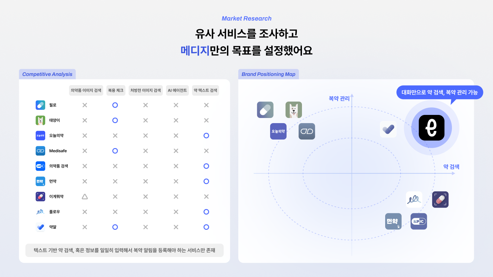
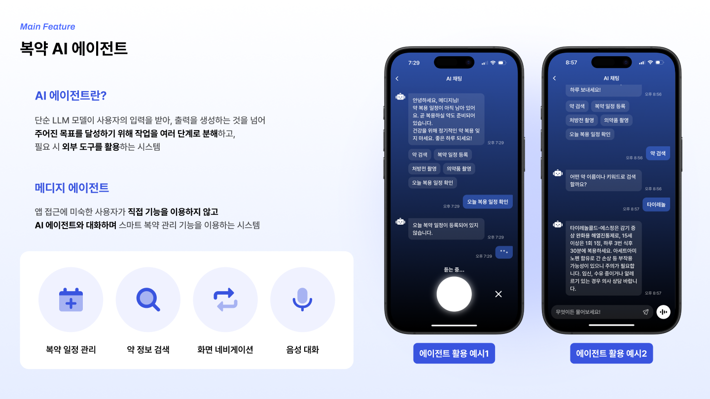
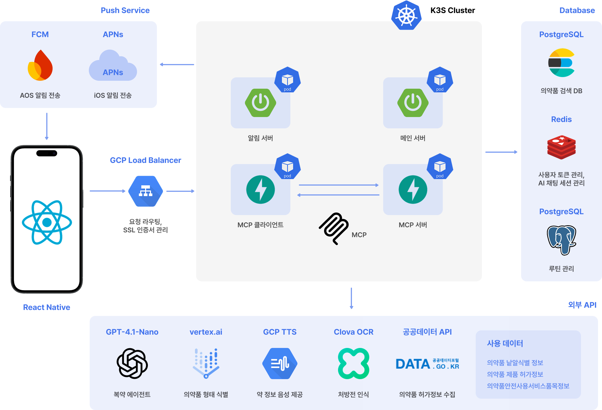

 _활용_공모전-darkgreen?style=for-the-badge&logo=trophy)
 
 

# 메디지(MedEasy) - 디지털 소외 계층을 위한 대화형 AI 복약 관리 비서

> [!NOTE]
> 고령자와 같이 시력이 좋지 않은 **디지털 소외 계층**은 복약 관리 앱의 복잡한 사용법으로 인해 접근이 어려워, **약을 복용하지 않거나 중복 복용**하는 등의 문제가 자주 발생하며 보호자의 도움이 필요하다.
> 
> 메디지는 이러한 문제를 해결하기 위해 **MCP와 LangGraph 기반의 음성 대화 인터페이스**를 도입하여 사용자가 별도의 조작 없이도 복약 현황을 관리할 수 있도록 설계되었다.
> 
> 복약 누락 시 **보호자에게 실시간 알림**을 보내고, **보호자 계정과의 연동**을 통해 피보호자의 복약 상태를 원격으로 모니터링할 수 있다.
> 
> 또한 95% 이상의 정확도로 **알약 이미지 검색**이 가능해 약에 대한 정보가 부족하거나 시각적 구분이 어려운 사용자도 의약품 정보를 쉽게 확인할 수 있다.

- 복잡한 폼 입력 대신 **음성 대화 + 처방전/알약 촬영 + NFC 태깅**으로 복약 관리
- **MCP + LangGraph 기반 AI 에이전트**가 사용자를 대신해 복약 관리 기능(조회·등록·기록)을 실행
- **식약처 공공데이터 + 이미지 인식 + OCR**로 약 정보·병용금기·노인주의 정보를 신뢰성 있게 제공
- **보호자 연동 + 푸시 알림**으로 고령자의 복약 누락·중복 복용 위험을 줄이고 돌봄 피로를 완화

## 지금 메디지를 먼저 사용해보세요

정식 출시 전 iPhone에서 메디지를 미리 체험할 수 있습니다.  
TestFlight를 통해 설치하고 음성 기반 복약 관리 플로우를 직접 경험해 보세요.

  

## 1. 문제 (Issues)

### I. 고령자의 디지털 역량 한계

- 복약 관리 앱은 많지만, 실제로 **고령층의 복약 관리 앱 사용률은 2.5% 미만**입니다.
- **작은 글자, 복잡한 메뉴, 많은 입력 항목** 때문에 설치 후에도 정착이 잘 되지 않습니다.
- 복잡한 복약 스케줄(다수의 약, 여러 시점, 서로 다른 용량)을 **직접 관리하기 어렵습니다.**

### II. 복약 오류와 건강 리스크

- **복용 누락**(먹어야 할 약을 잊음)
- **중복 복용**(이미 먹은 약을 다시 복용)
- **오래된 약·정체를 모르는 약 복용**으로 인한 병용금기·부작용 위험

### III. 보호자의 돌봄 피로도

- 보호자는 하루에도 여러 번 **약 먹었는지** 확인해야 합니다.
- 전화·메신저 확인에 의존하다 보니 **시간·정서적 피로**가 큽니다.
- 장기 돌봄 상황에서는 일상·업무와 병행하기 어렵습니다.

## 2. 시장 조사
유사 서비스를 조사하고 메디지만의 목표를 설정했습니다.

### I. 경쟁 서비스
> 대부분의 기존 앱은 **텍스트 기반 검색** 또는 **직접 입력 방식**에 의존하고 있어 
> 고령자나 디지털 취약 계층에게는 사용 난이도가 높습니다.

### II. 브랜드 포지셔닝 맵
메디지가 목표로 하는 포지션은 **대화만으로 약 검색·복약 관리가 가능한 서비스**입니다.

## 3. 솔루션 & 핵심 가치 (Solutions & Values)

### Solution 1. 음성 중심 복약 관리 (Conversational UX)

- 고령자는 **“앱을 다루는 법” 대신 “말하는 것”만 알면 됨**
- STT/TTS(Clova Voice)를 통해 **음성으로 질문·응답**하며 복약을 관리
- AI 에이전트가 사용자의 자연어를 복약 정보(약 이름, 용량, 횟수, 기간 등)로 구조화

> 예시  
> “오늘 받은 혈압약 복약 일정 좀 등록해줘.”  
> → AI가 질문을 쪼개어 약 이름·복용 횟수·기간 등을 물어보고 일정까지 자동 등록

### Solution 2. 빠르고 신뢰성 있는 약 정보 제공

- **식품의약품안전처 공공데이터** 기반
  - 의약품 허가 정보
  - 의약품 낱알 식별 정보
  - DUR(병용금기, 노인주의 등) 안전 정보
- **알약 촬영 + 벡터 검색 + 유사도 알고리즘**으로 이름을 몰라도 약을 찾을 수 있음
- 오래 보관한 약·기억이 나지 않는 약도 **촬영만으로 정보 확인** 가능

### Solution 3. 보호자 연동 & 알림

- **인증 코드 기반 보호자 연동**으로 신뢰성 있는 페어링
- 보호자가:
  - 피보호자의 **복약 스케줄·복약 여부를 실시간으로 확인**
  - 복약 일정을 **대리 등록** 가능
- 복약 시간, 복약 누락(0분·30분·60분 경과), 복약 기록에 맞춰  
  **사용자·보호자에게 푸시 알림** 전송

### Solution 4. NFC 태깅 기반 “원터치” 복약 체크

- 메디지 전용 **NFC 카드**를 제공
- “어떤 화면으로 들어가서 어떤 약을 눌러야 하는지” 찾지 않고  
  **폰을 카드에 태그하는 것만으로 복약 완료 처리**
- 백그라운드 상태에서도 **NFC 태깅 → 복약 처리 핸들러 실행 → 서버 기록**까지 한 번에 수행

## 4. 주요 기능 (Features)

| 기능 | 설명 |
|------|------|
| **복약 AI 에이전트** | MCP + LangGraph 기반 AI 에이전트가 사용자의 자연어를 이해하고, 복약 조회·등록·기록 API를 대신 호출합니다. |
| **음성 대화 인터페이스** | Clova STT/TTS를 사용해 고령자가 텍스트 입력 없이도 “말하기”만으로 복약 관리 기능을 사용할 수 있습니다. |
| **알약 촬영 검색** | Vertex AI + 공공데이터 기반으로 알약의 색상·모양·마크를 인식하고, 유사도 검색으로 가장 유력한 약품 후보를 제시합니다. |
| **처방전 촬영 → 일정 자동 등록** | 클로바 OCR로 처방전 텍스트를 추출하고, 복약 정보로 구조화해 여러 개 약의 일정도 한 번에 등록합니다. |
| **보호자 연동** | 보호자·피보호자 계정을 연결하고, 복약 일정/이력 조회 및 대리 일정 등록·관리가 가능합니다. |
| **푸시 알림** | 복약 예정 시간, 누락 시 리마인드, 복약 완료 시점 등을 iOS 푸시로 사용자와 보호자에게 동시에 알립니다. |
| **NFC 태깅 복약 체크** | 전용 NFC 카드를 태깅하면 앱 진입 및 약 선택 없이 바로 복약 기록이 처리됩니다. |

## 5. AI 에이전트 성능 최적화 (AI Performance)

메디지 팀은 **AI 에이전트 성능과 응답 속도**를 핵심 지표로 두고 고도화했습니다.

### I. 응답 지연 시간 개선

- 초기: 외부 라이브러리 + GPT-4o-mini 사용 시 **평균 약 10.5초**
- 최적화 과정:
  - 도구 초기화 시점 조정 및 캐싱
  - 모델 변경: **GPT-4.1-nano**로 교체
  - LangGraph 기반 **단계별 처리 플로우 최적화**
- 결과: **평균 약 3.6초 (66% 단축)**

### II. 사용자 의도 이해도 개선

복약 일정 조회/등록 시나리오를 중심으로 30회 테스트 기준:

- 의도 분류 정확도: **67% → 90%**
- 필요한 정보 추출 정확도: **57% → 83%**
- 적절한 도구 선택 성공률: **70% → 93%**
- 사용자에게 재질문이 필요한 비율: **43% → 13%**
- 전체 작업 성공률: **60% → 87%**

> **사용자 의도 분석 → 도구 선택 → 결과 검증 → 재질문 → 최종 응답**으로 이어지는  
> **그래프 기반 에이전트 구조**를 도입해 실제 사용 시 실패율을 낮추는 데 집중했습니다.

## 6. 알약 이미지 검색 & OCR 파이프라인 (Image Search)

### I. 알약 이미지 검색

- **입력**: 사용자가 촬영한 알약 사진
- **전처리**: 크롭, 밝기 보정, 노이즈 제거
- **특징 추출**:
  - 색상 그룹 (예: 노랑/주황/분홍/빨강/갈색 계열 묶음)
  - 제형 (원형, 타원형/장방형 등)
  - 각인/마크, 분할선 등
- **표준화 & 벡터화**:
  - 식약처 의약품 낱알 식별 데이터를 정규화해서 Elasticsearch에 벡터로 저장
- **검색**:
  - 색상·제형 필터 + 각인 토큰화 기반 유사도 검색
  - 일정 점수 이하일 경우 다른 각도로 촬영한 이미지 재검색(멀티 앵글 검증)

**정확도 개선**

- 초기 인식률: **약 40%**
- 이미지 전처리 도입: 50%
- 색상/모양 분류 최적화(504개 기준): 82.9%
- 문자 인식 개선(1000개 기준): 89.7%
- 알약 데이터 정제(2000개 기준): **최종 약 96.6%**

### II. 처방전 OCR 기반 복약 일정 등록

- **Clova OCR**로 처방전/약봉투의 텍스트 추출
- 약 이름·복용량·복용 횟수·복용 일수 등을 구조화
- 메디지 DB에 있는 의약품 정보와 매칭
- AI 검증 단계를 추가해 **복약 정보 추출 정확도 85% → 99% 수준**으로 향상

## 7. 시스템 아키텍처 (Architecture)

### I. Cloud Native MSA on Ncloud Kubernetes Service

- **모바일 앱**: React Native
- **백엔드 서비스 분리**
  - 복약 스케줄 관리 서버: Spring Boot + PostgreSQL
  - 알림 서버: Spring Boot + Redis (스케줄러 기반 배치 전송)
  - 약 검색/이미지 검색 서버: FastAPI + Elasticsearch
  - AI 에이전트 MCP 서버: FastAPI + Redis
- **인프라**
  - Ncloud Kubernetes Service(NKS)
  - Ncloud Load Balancer + Ingress (API Gateway 역할)
  - Ncloud Container Registry, Source Commit, Source Pipeline (CI/CD)
- **AI/외부 서비스**
  - OpenAI GPT-4.1-nano (에이전트 대화)
  - Clova Voice (STT/TTS)
  - Clova OCR (처방전/약봉투 인식)
  - Vertex AI (알약 이미지 분류/객체 인식)
  - 공공데이터포털(식약처 의약품 허가·낱알식별·DUR)

### II. MCP 기반 보안 설계

- AI 에이전트가 직접 전체 API에 접근하면 보안 리스크가 커지므로,
  - **AI ←→ MCP 서버 ←→ 메디지 API 서버** 구조로 분리
  - MCP 레벨에서 **기능별 인가·토큰 검증·호출 제어**를 추가해 보안성을 높였습니다.

## 8. 기술 스택 (Tech Stack)

### I. Frontend (Mobile)

- **React Native**
- **TypeScript**
- Navigation / State / API 연동 (React Query 등)
- TestFlight 배포

### II. Backend & AI

- **Spring Boot** (복약 스케줄·사용자/보호자 관리, 알림 스케줄)
- **FastAPI** (AI 에이전트, 알약 검색/이미지 분석)
- **PostgreSQL** (사용자·복약 일정·의약품 메타데이터)
- **Redis** (세션·캐시·알림 큐)
- **Elasticsearch** (낱알 식별 유사도 검색)
- **OpenAI GPT-4.1-nano** + **LangGraph** + **MCP**
- **Naver Clova Voice / OCR**
- **GCP Vertex AI** (알약 이미지 분류/객체 탐지)

### III. Infra & DevOps

- **Ncloud Kubernetes Service (NKS)**
- **Ncloud Load Balancer / Ingress**
- **Ncloud Container Registry**
- **Ncloud Source Commit / Source Pipeline** (CI/CD)
- **FCM / APNs** (푸시 알림)

## 9. 외부 API 및 서비스 (External Services)

| 구분 | 서비스 / API | 용도 |
|-----|---------------|-------|
| 공공데이터포털 | 식약처 의약품 허가 정보 / 낱알 식별 / DUR | 알약 이름, 성분, 병용금기/노인주의 정보 조회 |
| OpenAI GPT-4.1-nano | LangGraph 기반 대화형 복약 에이전트 | 사용자 의도 파악, 복약 루틴 추출 및 기능 호출 제어 |
| Naver Clova Voice | STT / TTS | 사용자의 음성을 텍스트로 변환, 약 설명을 음성으로 안내 |
| Naver Clova OCR | 처방전/약봉투 이미지 OCR | 약 이름, 복용량, 횟수, 기간 등 정보 추출 |
| Vertex AI (GCP) | 알약 이미지 분류 / 객체 인식 | 알약 색상·제형·각인 분석 및 유사도 검색용 특징 추출 |
| FCM / APNs | 푸시 알림 발송 | 복약 시간, 누락 알림, 보호자 알림 |
| Ncloud K8S + Load Balancer | 인프라 운영 | Cloud Native MSA 기반 백엔드 운영 및 트래픽 분산 |

## 10. 기대 효과 (Outcomes)

| 번호 | 내용 |
|------|------|
| **01** | 음성 대화를 통한 복약 관리로 **디지털 취약 계층의 정보 접근성 향상** |
| **02** | NFC 태그 기반 복약 체크와 푸시 알림으로 **백그라운드에서 복약 관리** |
| **03** | 약 95% 정확도의 의약품 촬영 기능으로 **약 이름 없이도 간편한 검색 가능** |
| **04** | 복용 금기 및 약물 간 상호작용 정보 제공으로 **부작용 및 오남용 예방** |
| **05** | 가족 또는 간병인의 실시간 복약 현황 확인으로 **돌봄 효율 향상** |

## 11. 확장성 (Impact)

### 서비스 확장성 (Service Expansion)

#### 01. AI 에이전트의 사용자 커스텀 기능 강화
- **현재 방식**: 단순히 대화를 저장하여 대화의 흐름을 유지하는 데 집중
- **개선 방향**: 일정 주기로 대화 로그를 분석하여, 사용자 개인의 복약 패턴을 분석해 개인에게 맞는 AI 서비스를 제공

#### 02. 알약 촬영 의약품 안전 검색 모드 추가
- **현재 방식**: 알약 사진 퀄리티에 따라 잘못된 결과 및 클릭 확인이 존재
- **개선 방향**: 사용자가 이전에 복용, 검색, 조회하였던 의약품에 가중치를 주어 검색 결과 제공

### 시스템 확장성 (System Expansion)

#### 03. AI 기능 특화 로드밸런싱
- **현재 방식**: 요청을 균등하게 분배하는 일반 로드밸런싱 방식 사용
- **개선 방향**: AI 작업 복잡도를 예측, 부하에 따라 균등하게 요청을 분배 → 컴퓨팅 자원 효율화

#### 04. 관찰가능성 도입
- **현재 방식**: 서비스별로 로그 관리, 장애 발생 시 디버깅
- **개선 방향**: 서비스의 로그, 트레이스, 메트릭 데이터에 식별자를 추가하고 연관하여 저장

## 12. 팀 소개 (Team)

| Profile | Name | Role | Contact |
|----------------------|------|------|----------|
|  | 👑 박지원 | Backend Developer | Email: angry9908@gmail.com GitHub: [@jiwonp7747](https://github.com/jiwonp7747) |
|  | 홍영준 | Backend Developer | Email: moejihong@gmail.com GitHub: [@HONGMOEJI](https://github.com/HONGMOEJI) |
|  | 조현주 | UX/UI / Frontend Developer | Email: hyynjju@gmail.com GitHub: [@hyynjju](https://github.com/hyynjju) |
|  | 김가영 | Frontend Developer | Email: gy0424ya@gmail.com  GitHub: [@kimgazii](https://github.com/kimgazii) |
|  | 양예영 | Frontend Developer | Email: yangyeyoung13@gmail.com GitHub: [@hs-2171117-yeyoungyang](https://github.com/hs-2171117-yeyoungyang) |
