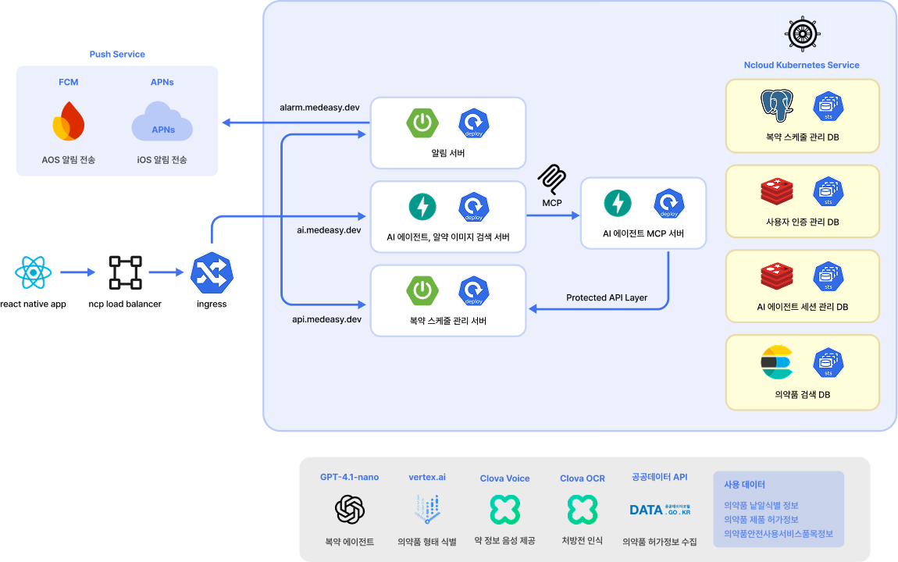
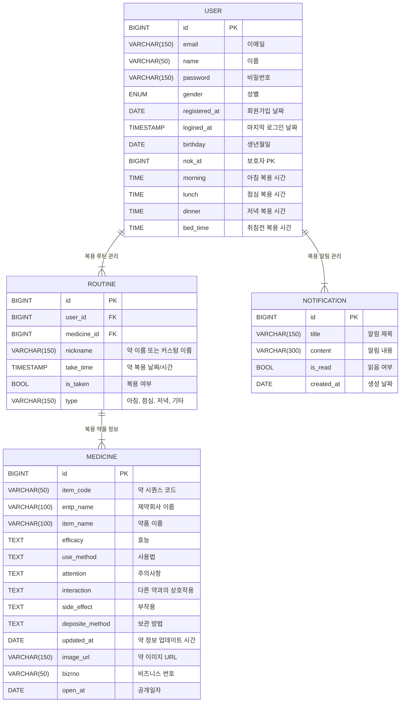

# 💊 메디지(MedEasy) - 디지털 소외 계층을 위한 대화형 복약 어플리케이션

    

> [!NOTE]
> 고령자와 같이 시력이 좋지 않은 **디지털 소외 계층**은 복약 관리 앱의 복잡한 사용법으로 인해 접근이 어려워, **약을 복용하지 않거나 중복 복용**하는 등의 문제가 자주 발생하며 보호자의 도움이 필요하다.
> 
> 메디지는 이러한 문제를 해결하기 위해 **MCP와 LangGraph 기반의 음성 대화 인터페이스**를 도입하여 사용자가 별도의 조작 없이도 복약 현황을 관리할 수 있도록 설계되었다.
> 
> 복약 누락 시 **보호자에게 실시간 알림**을 보내고, **보호자 계정과의 연동**을 통해 피보호자의 복약 상태를 원격으로 모니터링할 수 있다.
> 
> 또한 95% 이상의 정확도로 **알약 이미지 검색**이 가능해 약에 대한 정보가 부족하거나 시각적 구분이 어려운 사용자도 의약품 정보를 쉽게 확인할 수 있다.

---

## 🚀 주요 기능
| 💊 복용 루틴           | 💬 AI 채팅             | 🔎 의약품 검색         |
|--------------------|---------------------|----------------------|
|  |    |  |

| 🫂 보호 대상 관리           | 🚫 금기 정보         | 💬 NFC 태그            |
|--------------------|------------------------|----------------------|
|  |  |    |

---

## 🎯 기대 효과

| 번호 | 내용 |
|------|------|
| **01** | 음성 대화를 통한 복약 관리로 **디지털 취약 계층의 정보 접근성 향상** |
| **02** | NFC 태그 기반 복약 체크와 푸시 알림으로 **백그라운드에서 복약 관리** |
| **03** | 약 95% 정확도의 의약품 촬영 기능으로 **약 이름 없이도 간편한 검색 가능** |
| **04** | 복용 금기 및 약물 간 상호작용 정보 제공으로 **부작용 및 오남용 예방** |
| **05** | 가족 또는 간병인의 실시간 복약 현황 확인으로 **돌봄 효율 향상** |

---

## 🏗️ 기술 스택
| 구분 | 기술 스택 |
|------|-----------|
| 💻 **Frontend** |  |
| 🛠️ **Backend** |    |
| 🤖 **AI & Data Processing** |    |
| ☁️ **Cloud & Infrastructure** |   |
| 🚀 **Deployment & Version Control** |   |

---

## 🛠️ 시스템 아키텍처

---

## 📋 ERD 설계

---

## 🌐 외부 API 및 서비스

| 구분 | 서비스 / API | 용도 |
|------|---------------|------|
| 🏥 **공공데이터 포털** | 의약품 정보 개방 시스템 API | 알약 이름, 성분, 금기사항 조회 |
| 🧠 **OpenAI GPT-4.1-Nano** | LangGraph 기반 대화형 복약 상담 | 자연어 이해 및 복약 루틴 추출 |
| 🧾 **Naver Clova OCR** | 처방전 이미지 문자 인식 | 약 이름, 용량 등 정보 추출 |
| 📷 **Vertex AI (GCP)** | 알약 이미지 분류 | 알약 이름, 제형, 색상 예측 |
| 🔈 **GCP Text-to-Speech** | 약 설명 음성 안내 | 시각장애 또는 고령자 지원 |
| 📲 **FCM / APNs** | 푸시 알림 발송 | 복약 시간, 누락 시 보호자 알림 |
| ☁️ **GCP Load Balancer** | 트래픽 분산 | 앱 안정성 확보 |
| 🐳 **K3S + Compute Engine** | 백엔드 운영 및 배포 | 경량 쿠버네티스 클러스터 기반 운영 |

---

## ⭐️ 팀 소개

| Profile | Name | Role | Contact |
|----------------------|------|------|----------|
|  | 👑 홍영준 | Backend Developer | Email: moejihong@gmail.com GitHub: [@HONGMOEJI](https://github.com/HONGMOEJI) |
|  | 박지원 | Backend Developer | Email: angry9908@gmail.com GitHub: [@jiwonp7747](https://github.com/jiwonp7747) |
|  | 조현주 | UX/UI / Frontend Developer | Email: hyynjju@gmail.com GitHub: [@hyynjju](https://github.com/hyynjju) |
|  | 김가영 | Frontend Developer | Email: gy0424ya@gmail.com  GitHub: [@kimgazii](https://github.com/kimgazii) |
|  | 양예영 | Frontend Developer | Email: yangyeyoung13@gmail.com GitHub: [@hs-2171117-yeyoungyang](https://github.com/hs-2171117-yeyoungyang) |
